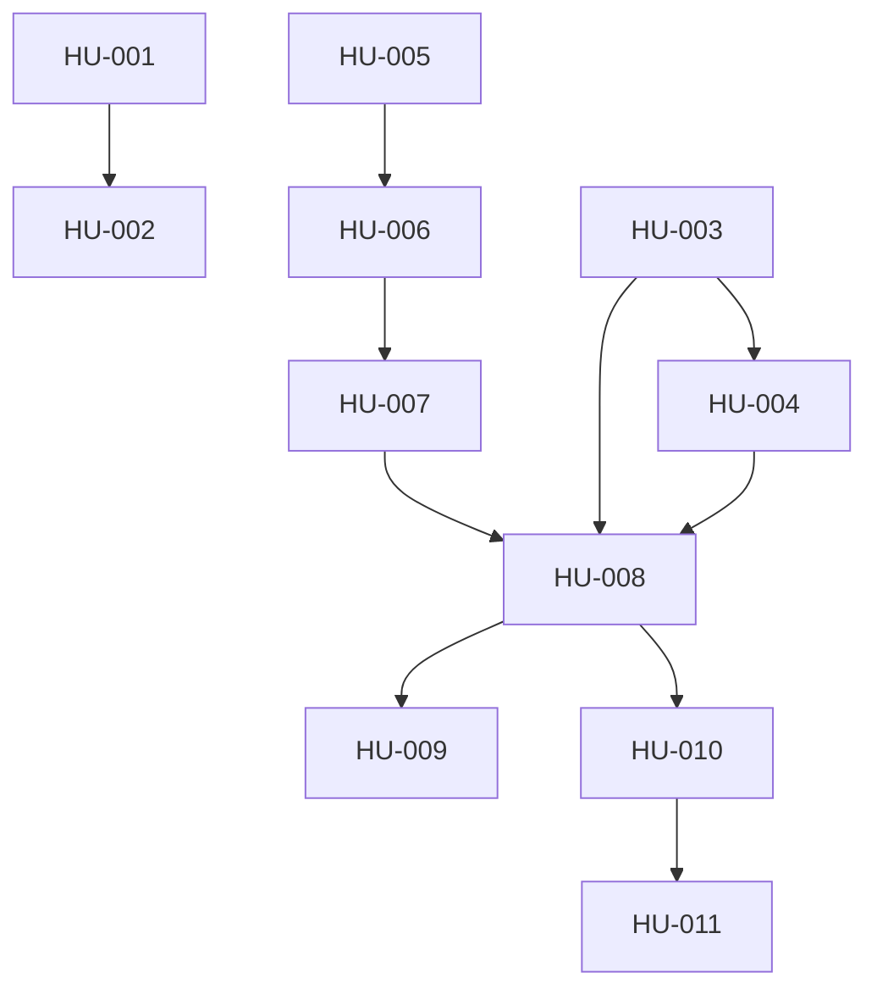

# Backlog Tecnico - Estabilizacion Base de Datos Aerolinea

## Informacion del proyecto

| Campo | Valor |
|-------|-------|
| **Proyecto** | Aerolinea DB - Estabilizacion de base de datos |
| **Version** | 1.0 |
| **Fecha** | 2026-04-20 |
| **Responsable** | Aprendiz - Analisis y Desarrollo de Software |

---

## Resumen del backlog

| Prioridad | Cantidad de HUs |
|-----------|-----------------|
| Alta | 7 |
| Media | 4 |
| **Total** | **11** |

---

## Objetivo

Traducir las historias de usuario vigentes a un backlog tecnico claro, con tareas, dependencias, esfuerzo estimado y entregables, manteniendo ademas observaciones de alineacion frente al estado real del repositorio.

## Backlog de Historias de Usuario

### HU-001: Crear plan de trabajo inicial

| Campo | Valor |
|-------|-------|
| **Prioridad** | Alta |
| **Estado** | Completada |
| **Dependencias** | - |
| **Esfuerzo estimado** | 30 min |
| **Entregable** | `docs/plan_trabajo_inicial.md` |

**Tareas tecnicas:**

- [x] Definir cronograma de 5 horas
- [x] Distribuir actividades por hora
- [x] Asignar cada actividad a una HU
- [x] Documentar riesgos y mitigaciones

**Criterios de aceptacion:**

- Documento con cronograma hora por hora
- Actividades priorizadas
- Tiempo total de 5 horas

### HU-002: Realizar documento de seguimiento

| Campo | Valor |
|-------|-------|
| **Prioridad** | Alta |
| **Estado** | Completada |
| **Dependencias** | HU-001 |
| **Esfuerzo estimado** | 30 min |
| **Entregable** | `docs/seguimientos.md` |

**Tareas tecnicas:**

- [x] Crear bitacora con fechas y horas
- [x] Registrar estado de cada HU
- [x] Documentar decisiones tecnicas
- [x] Identificar riesgos y mitigaciones
- [x] Registrar seguimiento de tareas

**Criterios de aceptacion:**

- Bitacora de seguimiento completa
- Estado actualizado de cada HU
- Decisiones tecnicas documentadas

### HU-003: Identificar dominios funcionales

| Campo | Valor |
|-------|-------|
| **Prioridad** | Alta |
| **Estado** | Completada con ajuste |
| **Dependencias** | - |
| **Esfuerzo estimado** | 60 min |
| **Entregable** | `docs/analisis_dominios.md` |

**Tareas tecnicas:**

- [x] Analizar el modelo disponible
- [x] Identificar dominios funcionales
- [x] Listar entidades principales por dominio
- [x] Documentar relaciones entre dominios
- [ ] Crear diagrama de relaciones en Mermaid

**Criterios de aceptacion:**

- Dominios identificados y documentados
- Entidades principales documentadas
- Relaciones entre dominios descritas

**Observacion de alineacion:**

- La HU original habla de 12 dominios.
- El repositorio actual implementa 13 dominios, incluyendo `notificaciones`.

### HU-004: Crear ADRs (Architecture Decision Records)

| Campo | Valor |
|-------|-------|
| **Prioridad** | Alta |
| **Estado** | Completada con ajuste |
| **Dependencias** | HU-003 |
| **Esfuerzo estimado** | 60 min |
| **Entregable** | ADRs en `docs/` |

**Tareas tecnicas:**

- [x] ADR-001: Nuevo dominio de notificaciones
- [x] ADR-002: RLS y permisos diferenciados
- [x] ADR-003: Implementacion de Liquibase
- [x] ADR-004: Ramas develop/qa/main
- [x] ADR-005: Contenerizacion

**Criterios de aceptacion:**

- 5 ADR completos
- Cada ADR con titulo, contexto, decision, justificacion y consecuencias

**Observacion de alineacion:**

- La HU menciona `docs/adr/`.
- El repositorio actual guarda los ADR directamente en `docs/`.

### HU-005: Crear la estructura base del repositorio

| Campo | Valor |
|-------|-------|
| **Prioridad** | Alta |
| **Estado** | Completada |
| **Dependencias** | - |
| **Esfuerzo estimado** | 30 min |
| **Entregable** | Repositorio estructurado |

**Tareas tecnicas:**

- [x] Estructurar carpetas principales del proyecto
- [x] Crear modulos `01_ddl`, `02_dml`, `03_dcl`, `04_tcl`, `05_rollbacks`
- [x] Crear carpetas `docs/` y `scripts/`
- [x] Crear `.gitignore` y `README.md`
- [ ] Validar ramas `develop`, `qa`, `main`
- [ ] Confirmar commit inicial desde evidencia local

**Criterios de aceptacion:**

- Estructura de carpetas completa
- Repositorio organizado para trabajo por modulos

### HU-006: Contenerizar PostgreSQL para levantar la base de datos

| Campo | Valor |
|-------|-------|
| **Prioridad** | Alta |
| **Estado** | Completada |
| **Dependencias** | HU-005 |
| **Esfuerzo estimado** | 30 min |
| **Entregable** | `docker-compose.yaml` |

**Tareas tecnicas:**

- [x] Crear servicio `postgres` en `docker-compose.yaml`
- [x] Configurar puerto `25432`
- [x] Configurar variables de entorno
- [x] Configurar healthcheck
- [ ] Probar `docker-compose up -d postgres`
- [ ] Verificar conexion con `psql`

**Criterios de aceptacion:**

- PostgreSQL definido en contenedor
- Puerto `25432` expuesto
- Healthcheck configurado

### HU-007: Contenerizar Liquibase e integrarlo al proyecto

| Campo | Valor |
|-------|-------|
| **Prioridad** | Alta |
| **Estado** | Completada con ajuste |
| **Dependencias** | HU-006 |
| **Esfuerzo estimado** | 45 min |
| **Entregable** | `docker-compose.yaml`, `liquibase.properties` |

**Tareas tecnicas:**

- [x] Crear servicio `liquibase` en `docker-compose.yaml`
- [x] Configurar `liquibase.properties`
- [x] Conectar Liquibase a PostgreSQL
- [x] Montar changelogs y modulos SQL en volumenes
- [ ] Probar `liquibase update` en entorno local
- [ ] Confirmar ejecucion sin errores en contenedor

**Criterios de aceptacion:**

- Liquibase configurado
- Conexion exitosa a PostgreSQL
- Migraciones listas para ejecutarse

**Observacion de alineacion:**

- La HU menciona `docker/liquibase/Dockerfile` y profile `tooling`.
- El repositorio actual usa imagen directa de Liquibase en `docker-compose.yaml`.

### HU-008: Implementar DDL y ADRs a la estructura base del repositorio

| Campo | Valor |
|-------|-------|
| **Prioridad** | Media |
| **Estado** | Completada |
| **Dependencias** | HU-003, HU-004, HU-005, HU-007 |
| **Esfuerzo estimado** | 90 min |
| **Entregable** | `01_ddl/` completo, `changelog/changelog-master.yaml` |

**Tareas tecnicas:**

- [x] Crear `01_ddl/00_extensions/changelog.yaml` y `pgcrypto.sql`
- [x] Crear `01_ddl/01_schemas/changelog.yaml` y `create_schemas.sql`
- [x] Crear `01_ddl/02_types/changelog.yaml`
- [x] Crear `01_ddl/03_tables/changelog.yaml`
- [x] Crear archivos SQL por dominio
- [x] Crear `changelog/changelog-master.yaml`
- [x] Crear archivos de rollback en `05_rollbacks/`
- [ ] Ejecutar `liquibase update` para validacion final

**Criterios de aceptacion:**

- 13 dominios implementados
- Changelogs por subcarpeta
- Rollbacks para la mayor parte de los changesets operativos

### HU-009: Implementar roles y permisos

| Campo | Valor |
|-------|-------|
| **Prioridad** | Media |
| **Estado** | Completada |
| **Dependencias** | HU-008 |
| **Esfuerzo estimado** | 45 min |
| **Entregable** | Archivos en `03_dcl/` |

**Tareas tecnicas:**

- [x] Crear `03_dcl/00_roles/changelog.yaml` y scripts de roles
- [x] Crear `03_dcl/01_grants/changelog.yaml` y scripts de grants
- [x] Crear `03_dcl/02_policies/changelog.yaml` y politicas RLS
- [x] Crear rollbacks correspondientes
- [ ] Probar politicas de seguridad en ejecucion real

**Criterios de aceptacion:**

- Roles creados
- Grants asignados correctamente
- Politicas RLS implementadas

### HU-010: Construir plan de datos de prueba con orden de carga por dependencias

| Campo | Valor |
|-------|-------|
| **Prioridad** | Media |
| **Estado** | Completada |
| **Dependencias** | HU-008 |
| **Esfuerzo estimado** | 30 min |
| **Entregable** | `docs/plan_datos_prueba.md` |

**Tareas tecnicas:**

- [x] Identificar dependencias entre tablas
- [x] Definir fases de insercion
- [x] Ordenar tablas por fase
- [x] Documentar orden de carga
- [x] Crear estructura base en `02_dml/00_inserts/`

**Criterios de aceptacion:**

- Documento con orden de insercion
- Fases definidas
- Estructura de inserts creada

### HU-011: Realizar los inserts de datos de prueba

| Campo | Valor |
|-------|-------|
| **Prioridad** | Media |
| **Estado** | Completada |
| **Dependencias** | HU-010 |
| **Esfuerzo estimado** | 60 min |
| **Entregable** | Scripts en `02_dml/00_inserts/` |

**Tareas tecnicas:**

- [x] Crear inserts para catalogos base
- [x] Crear inserts para geografia
- [x] Crear inserts para aerolinea
- [x] Crear inserts para identidad
- [x] Crear inserts para seguridad
- [x] Crear inserts para clientes
- [x] Crear inserts para notificaciones
- [ ] Ejecutar inserts en orden
- [ ] Validar integridad referencial en entorno levantado

**Criterios de aceptacion:**

- Scripts de insercion por dominio
- Orden de ejecucion definido
- Datos listos para cargarse en la BD

---

## Diagrama de dependencias

---

## Resumen por historia de usuario

| HU | Nombre | Estado tecnico actual | Observacion |
|----|--------|-----------------------|-------------|
| HU-001 | Crear plan de trabajo inicial | Cumplida | Existe `docs/plan_trabajo_inicial.md` |
| HU-002 | Realizar documento de seguimiento | Cumplida | Existe `docs/seguimientos.md` |
| HU-003 | Identificar dominios funcionales | Cumplida con ajuste | El repo actual implementa 13 dominios |
| HU-004 | Crear ADRs | Cumplida con ajuste | Los ADR no estan en `docs/adr/`, sino en `docs/` |
| HU-005 | Crear la estructura base del repositorio | Cumplida | La estructura principal existe |
| HU-006 | Contenerizar PostgreSQL | Cumplida | `docker-compose.yaml` define `postgres` |
| HU-007 | Contenerizar Liquibase | Cumplida con ajuste | No existe `Dockerfile` dedicado en el estado actual |
| HU-008 | Implementar DDL y ADRs | Cumplida | `01_ddl` y `05_rollbacks` existen |
| HU-009 | Implementar roles y permisos | Cumplida | `03_dcl` contiene roles, grants y RLS |
| HU-010 | Construir plan de datos de prueba | Cumplida | Existe `docs/plan_datos_prueba.md` |
| HU-011 | Realizar inserts de datos de prueba | Cumplida | Existen scripts en `02_dml/00_inserts` |

## Ajustes documentales pendientes

1. Alinear la HU-003 con el estado real del repositorio, dejando explicito que hoy hay 13 dominios implementados.
2. Revisar la HU-004 respecto a la ubicacion de ADRs.
3. Revisar la HU-007 respecto al `Dockerfile` y al profile `tooling`.
4. Homologar nombres de documentos en `docs/` para evitar duplicados o variantes.

## Pendiente tecnico de siguiente iteracion

1. Implementar objetos de `01_ddl/04_views`.
2. Implementar objetos de `01_ddl/05_materialized_views`.
3. Implementar objetos de `01_ddl/06_functions`.
4. Implementar objetos de `01_ddl/07_procedures`.
5. Implementar objetos de `01_ddl/08_triggers`.
6. Definir rollback para `01_ddl/10_configuration`.
7. Agregar pruebas automatizadas de smoke para validar `databasechangelog`, schemas, tablas criticas y RLS.
8. Fortalecer la evidencia de validacion post-despliegue.

## Fuente de verdad tecnica

Validar siempre este backlog contra:

- `docs/Historias de usuario.md`
- `docs/plan_trabajo_inicial.md`
- `docs/seguimientos.md`
- `changelog/changelog-master.yaml`
- `01_ddl/changelog.yaml`
- `02_dml/changelog.yaml`
- `03_dcl/changelog.yaml`
- `docker-compose.yaml`
